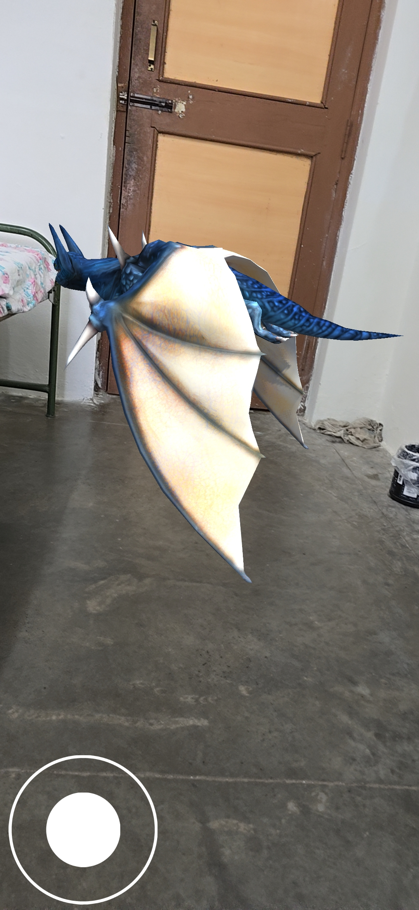
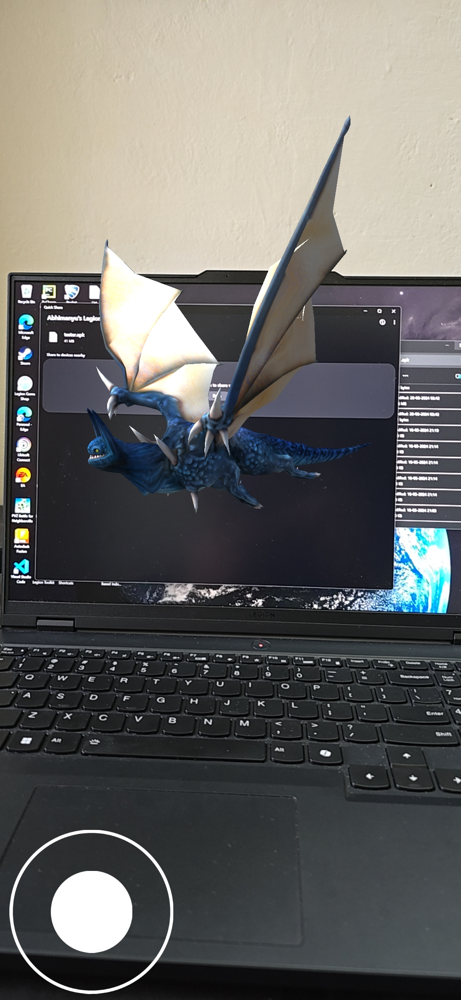

# AR Dragon Simulator

This Augmented Reality (AR) experience brings a flying dragon into your room, allowing you to control its flight path around your environment. The dragon is spawned when a specific reference image is detected, and users can guide it using touch controls. Built in Unity, this simulator offers an immersive blend of the virtual and physical world, creating a magical experience.

## Features:
- **Dragon Summoning via Image Tracking**: The dragon is spawned when the app detects a predefined reference image, integrating it into the real world.
- **Interactive Flight Control**: Control the dragon’s movement in real-time with on-screen touch controls or gestures, guiding it around your room.
- **Immersive AR Environment**: The dragon dynamically interacts with real-world objects, appearing to soar through your physical space.
- **Realistic Animations**: The dragon features lifelike flying and hovering animations, enhancing the sense of realism.

  
## Technologies Used:
- **Unity**: The project is developed in Unity, utilizing its AR capabilities for seamless integration of the dragon into the real world.
- **AR Foundation**: Built on AR Foundation to support cross-platform AR development, allowing for smooth image tracking and environmental understanding.
- **3D Model and Animations**: The dragon is a fully rigged 3D model with detailed animations for lifelike movement, created with Blender and imported into Unity.
- **ARCore/ARKit**: Depending on the platform (Android or iOS), the app leverages ARCore or ARKit to handle real-time image recognition and AR object placement.
  
## Technical Details:
- **Reference Image Detection**: The app uses AR Foundation's image tracking feature to detect the reference image, which triggers the dragon’s appearance.
- **Touch-Based Controls**: Unity’s Input System allows users to control the dragon’s flight direction, speed, and altitude through touch gestures.
- **Real-Time Rendering**: The dragon is rendered in real-time with Unity's built-in lighting, ensuring it matches the lighting conditions of your physical environment.
- **Physics Integration**: Unity’s physics engine handles collision detection, ensuring that the dragon behaves realistically around real-world objects.

## How to Use:
1. Point your device’s camera at the designated reference image to spawn the dragon.
2. Use touch gestures or on-screen controls to guide the dragon as it flies around your room.
3. Adjust the dragon's flight path and explore how it interacts with the physical environment.

## Requirements:
- Compatible with devices that support ARCore (Android) or ARKit (iOS).
- Unity version 2022.2 or higher for development.

